

<picture><source media="(prefers-color-scheme: dark)" srcset="assets/hero-dark.svg"></picture>

 

&nbsp;&nbsp;<a href="https://px-scripts.tebex.io">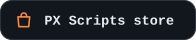</a>

 

<h2><picture><source media="(prefers-color-scheme: dark)" srcset="assets/h/01-dark.svg"></picture></h2>

I&#39;m **Arka** — online I go by **Phoenix GoD**. I take products from an empty folder to production, and I don&#39;t stay in one lane: the same week can be a CMS-driven site, a Flutter app, a Windows utility in .NET and a Lua resource for a FiveM server.

TypeScript is home base. Everything else gets picked for the job, not the hype. Founder of [@px-scripts](https://github.com/px-scripts).

<h2><picture><source media="(prefers-color-scheme: dark)" srcset="assets/h/02-dark.svg"></picture></h2>

| | What comes out of it | Built with |
|:--|:--|:--|
| **Web platforms** | Content-driven sites, storefronts and admin dashboards with a headless CMS behind them and motion-heavy frontends on top. | `Next.js` `React` `Payload` `Tailwind` `GSAP` |
| **APIs &amp; realtime** | Typed backends with auth, schema-first databases, sockets and scheduled jobs. | `Bun` `Hono` `Drizzle` `PostgreSQL` `Socket.IO` |
| **Mobile &amp; desktop** | Cross-platform apps for Android, Windows and Linux, plus native Windows tooling. | `Flutter` `Expo` `Electron` `.NET` |
| **Game-server tooling** | FiveM resources, in-game HUDs and NUI interfaces, and the storefront that sells them. | `Lua` `React` `FiveM` `Tebex` |
| **AI agents &amp; automation** | Voice assistants, desktop agents and pipelines that do the boring work unattended. | `Claude Agent SDK` `Gemini` `FastAPI` `Python` |
| **Programmatic video** | Promos and explainers rendered from React components instead of a timeline. | `Remotion` `TypeScript` |

<h2><picture><source media="(prefers-color-scheme: dark)" srcset="assets/h/03-dark.svg"></picture></h2>

<table>
<tr>
<td valign="top"><b>Languages</b></td>
<td>
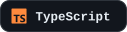
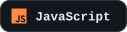

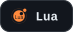
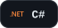
</td>
</tr>
<tr>
<td valign="top"><b>Frontend</b></td>
<td>
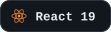
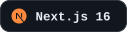

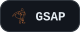

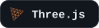
</td>
</tr>
<tr>
<td valign="top"><b>Backend</b></td>
<td>
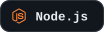

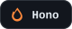

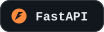
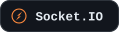
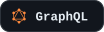

</td>
</tr>
<tr>
<td valign="top"><b>Data &amp; CMS</b></td>
<td>
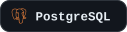
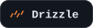
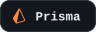

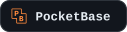
</td>
</tr>
<tr>
<td valign="top"><b>Mobile &amp; Desktop</b></td>
<td>

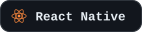

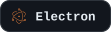
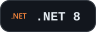
</td>
</tr>
<tr>
<td valign="top"><b>Game &amp; Creative</b></td>
<td>
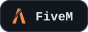
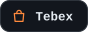
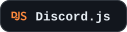

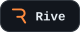

</td>
</tr>
<tr>
<td valign="top"><b>AI &amp; Automation</b></td>
<td>

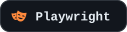
</td>
</tr>
<tr>
<td valign="top"><b>Ship &amp; Test</b></td>
<td>
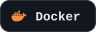
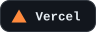
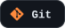
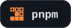

</td>
</tr>
</table>

<h2><picture><source media="(prefers-color-scheme: dark)" srcset="assets/h/04-dark.svg"></picture></h2>

- Shipping on **Next.js 16 + React 19** with the React Compiler switched on.
- Defaulting to **Bun, Hono, Drizzle and Postgres** for new backends.
- Spending more time in **Flutter and Dart** — one codebase for Android, Windows and Linux.
- Wiring real tools into agents with the **Claude Agent SDK**.

<h2><picture><source media="(prefers-color-scheme: dark)" srcset="assets/h/05-dark.svg"></picture></h2>

<picture><source media="(prefers-color-scheme: dark)" srcset="https://raw.githubusercontent.com/PhoenixGoDdev/PhoenixGoDdev/output/embers-dark.svg"></picture>

  

<picture><source media="(prefers-color-scheme: dark)" srcset="https://lanyard.cnrad.dev/api/854787326156603442?theme=dark&bg=0a0d12&borderRadius=14px&hideDiscrim=true&idleMessage=Probably%20shipping%20something"></picture>

<h2><picture><source media="(prefers-color-scheme: dark)" srcset="assets/h/06-dark.svg"></picture></h2>

<a href="https://gbnodes.host">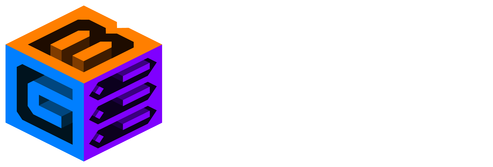</a>

<b>High-performance FiveM · Game · Web · Bot · Minecraft hosting</b> 
Network ASN <b>AS213574</b>

 

<picture><source media="(prefers-color-scheme: dark)" srcset="assets/footer-dark.svg"></picture>

